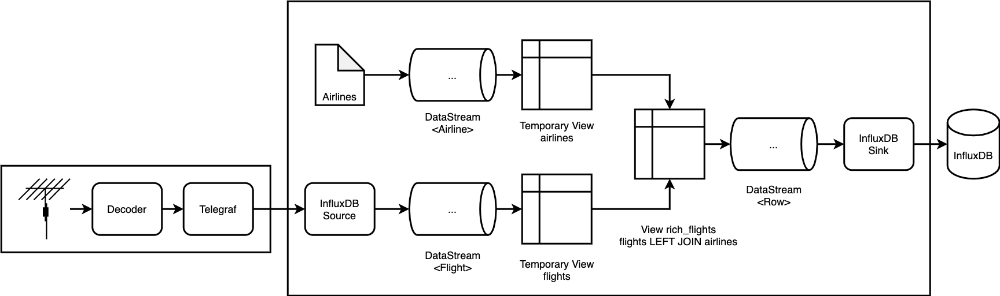
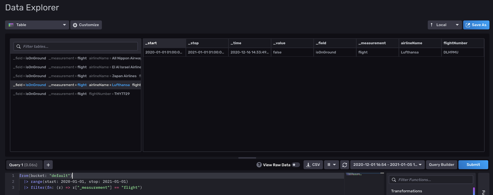

# flink-connector-influxdb-example

This is an example of how to configure and deploy the InfluxDB v2.0 connector for Apache Flink in a real-world scenario
on Kubernetes. It is an end-to-end test which leverages both the InfluxDB v2.0 source and sink connectors.



## Requirements

* 3+ CPU cores
* 8GB RAM
* Recent Linux OS, setup was tested on Ubuntu 20.04

## Usage

1. Install the required tools

  * Docker & docker-compose
  * [k3d](https://github.com/rancher/k3d#get)
  * [kubectl](https://kubernetes.io/docs/tasks/tools/install-kubectl-linux/)
  * [Helm](https://helm.sh/docs/intro/install/#from-apt-debianubuntu)

1. Build Flink App

   ```
   docker-compose build flinkapp
   docker-compose run --rm flinkapp bash
   gradle shadowJar
   ```

1. Create k3d cluster

   ```
   k3d cluster create flink
   kubectl config use-context k3d-flink
   kubectl cluster-info
   ```

1. Deploy InfluxDB with Helm

   ```
   helm repo add influxdata https://helm.influxdata.com/
   helm upgrade --install --set adminUser.password=adminadmin influxdb influxdata/influxdb2
   ```

1. Deploy Flink

    ```
    kubectl apply -f- <<'EOF'
    ---
    apiVersion: v1
    kind: ServiceAccount
    metadata:
      name: admin-user

    ---
    apiVersion: rbac.authorization.k8s.io/v1
    kind: ClusterRoleBinding
    metadata:
      name: admin-user
    roleRef:
      apiGroup: rbac.authorization.k8s.io
      kind: ClusterRole
      name: cluster-admin
    subjects:
    - kind: ServiceAccount
      name: admin-user
      namespace: default

    ---
    apiVersion: v1
    kind: Pod
    metadata:
      name: flink-cluster-manager
    spec:
      serviceAccountName: admin-user
      containers:
        - name: flink
          image: flink:1.12.1-scala_2.12-java8
          args: ["bin/kubernetes-session.sh", "-Dkubernetes.cluster-id=osdp", "-Dexecution.attached=true", "-Dresourcemanager.taskmanager-timeout=3600000", "-Dtaskmanager.memory.process.size=1024MB", "-Djobmanager.memory.process.size=1024MB", "-Dkubernetes.jobmanager.service-account=admin-user", "-Dkubernetes.rest-service.exposed.type=ClusterIP" ]

    ---
    apiVersion: v1
    kind: Service
    metadata:
      name: influxdb-source
    spec:
      selector:
        app: osdp
        component: taskmanager
      ports:
      - port: 8000
    EOF
    ```

    Troubleshooting:

    * Run `kubectl get pod`. Verify there is a running `flink-cluster-manager` and `osdp-SOMETHING-SOMETHING` pod.
    * If there is no `osdp-SOMETHING-SOMETHING` pod, look at the `flink-cluster-manager` logs: `kubectl logs pod/flink-cluster-manager`

1. Copy Flink App JAR and submit it to the Flink cluster

    ```
    kubectl cp build/libs/flink-influxdb-app-0.1-SNAPSHOT-all.jar flink-cluster-manager:/opt/flink/job.jar
    kubectl exec -it flink-cluster-manager -- bash
    ./bin/flink run --jobmanager osdp-rest:8081 ./job.jar
    ```

    Troubleshooting:

    * When running `./bin/flink run`, the command should print "Successfully submitted job ID"
    * Flink should spawn a new pod (`kubectl get pod`) with the name `osdp-taskmanager-1-1`. Verify the pod is running.
      If it isn't, this may be because of resource constraints (such as not having enough CPU resources). You can verify
      with `kubectl describe pod osdp-taskmanager-1-1`.

1. Deploy Telegraf

   ```
   docker build -t telegraf:flink telegraf
   docker save telegraf:flink > telegraf.tar
   k3d image import -c flink telegraf.tar
   kubectl apply -f- <<'EOF'
   apiVersion: apps/v1
   kind: Deployment
   metadata:
     name: telegraf
   spec:
     selector:
       matchLabels:
         app: telegraf
     replicas: 1
     template:
       metadata:
         labels:
           app: telegraf
       spec:
         containers:
         - name: telegraf
           image: telegraf:flink
   EOF
   ```

   Troubleshooting:

   * Have a look at the Telegraf logs. Find the name of the active Telegraf pod and views its logs:

     ```
     # kubectl get pods | grep telegraf
     telegraf-6b6b7696bb-4h7fj   1/1     Running   0          19m

     # kubectl logs telegraf-6b6b7696bb-4h7fj
     2021-03-16T14:03:10Z I! Starting Telegraf 1.17.3
     ```

1. Access the InfluxDB Web Interface

    Run `kubectl port-forward service/influxdb-influxdb2 8082:80` to forward the InfluxDB web interface server to your
    local machine on port 8082.

    Open [http://localhost:8082](http://localhost:8082), username is `admin`, and password is `adminadmin`.

    Log in and go to _Explore_. Click on _Script Editor_ to open the Flux editor. Select _Table_ as the _visualization_.

    Run this query:

    ```
    from(bucket: "default")
      |> range(start: 2020-01-01, stop: 2021-01-01)
      |> filter(fn: (r) => r["_measurement"] == "flight)
    ```

    You should see some results as shown below:

    

1. Next Steps

  * Access Flink Web Interface
    * `kubectl port-forward svc/osdp-rest 8081:8081`
    * Open [http://localhost:8081](http://localhost:8081)

1. For teardown and cleanup just run `k3d cluster delete flink`.


